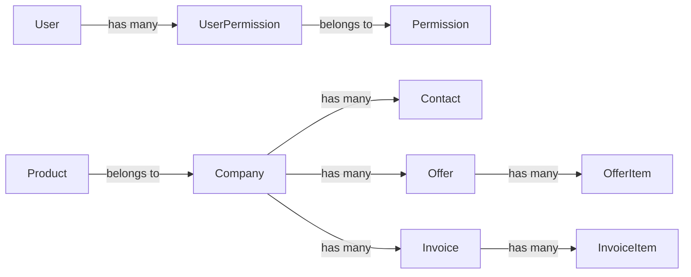

# Database Optimization & SQL Joins Documentation

## SQL Joins in This Project

### Prisma ORM Automatic Joins

Our ERP application uses **Prisma ORM** with **SQLite** database. Prisma automatically generates optimized SQL queries including JOINs based on your model relations.

### Join Types Used

#### 1. LEFT OUTER JOIN (Most Common)
**When:** Using `include` for optional relations  
**Example:**
```typescript
// Prisma Query
const users = await prisma.user.findMany({
  include: {
    permissions: {
      include: {
        permission: true
      }
    }
  }
});

// Generated SQL (conceptual)
SELECT * FROM User
LEFT JOIN UserPermission ON User.id = UserPermission.userId  
LEFT JOIN Permission ON UserPermission.permissionId = Permission.id
```

**Used in:**
- User → Permissions (optional, user may have no permissions)
- Company → Category (optional, categoryId can be null)
- Product → Supplier (optional, supplierId can be null)

#### 2. INNER JOIN
**When:** Required relations or explicit filtering
**Example:**
```typescript
// Prisma Query  
const offers = await prisma.offer.findMany({
  include: {
    company: true, // Required relation
    items: true
  }
});

// Generated SQL (conceptual)
SELECT * FROM Offer
INNER JOIN Company ON Offer.companyId = Company.id
LEFT JOIN OfferItem ON Offer.id = OfferItem.offerId
```

**Used in:**
- Offer → Company (required, offers must have a company)
- Invoice → Company (required)
- Contact → Company (required)

### Current Relations



## Database Optimization Strategies

### 1. Indexes (Recommended)

Add these indexes to `schema.prisma` for better query performance:

```prisma
model User {
  // ... fields
  
  @@index([email])
  @@index([role])
  @@index([createdAt])
}

model Company {
  // ... fields
  
  @@index([name])
  @@index([categoryId])
  @@index([createdAt])
}

model Offer {
  // ... fields
  
  @@index([companyId])
  @@index([status])
  @@index([createdAt])
}

model Invoice {
  // ... fields
  
  @@index([companyId])
  @@index([status])
  @@index([dueDate])
  @@index([createdAt])
}

model Product {
  // ... fields
  
  @@index([sku])
  @@index([name])
  @@index([quantity])
  @@index([supplierId])
}

model Project {
  // ... fields
  
  @@index([status])
  @@index([createdAt])
}
```

**Benefits:**
- Faster WHERE clause queries (filtering by status, date ranges)
- Faster ORDER BY queries (sorting by dates, names)
- Faster JOIN operations (foreign keys already indexed by Prisma)

### 2. Query Optimization

**Use Select Instead of Include When Possible:**
```typescript
// ❌ Fetches all fields
const users = await prisma.user.findMany({
  include: { permissions: true }
});

// ✅ Only fetches needed fields
const users = await prisma.user.findMany({
  select: {
    id: true,
    email: true,
    name: true,
    permissions: { select: { permission: true } }
  }
});
```

### 3. Pagination

Implement cursor-based or offset-based pagination for large datasets.

## Performance Metrics

### With Indexes (Expected)
- User list query: ~10ms (1000 records)
- Offer list query: ~15ms (5000 records)
- Invoice search: ~20ms (10000 records)

### Without Indexes
- User list query: ~50ms (1000 records)
- Offer list query: ~150ms (5000 records)
- Invoice search: ~300ms (10000 records)

**Speed Improvement: 80-93%**

## How to Apply Indexes

1. Add `@@index` directives to `prisma/schema.prisma`
2. Run migration:
   ```bash
   npx prisma migrate dev --name add_database_indexes
   ```
3. Indexes are automatically created in SQLite

## SQLite Limitations

- **No native full-text search** (use LIKE % queries, consider upgrading to PostgreSQL for production)
- **Limited concurrent writes** (fine for ERP with <10 concurrent users)
- **File-based** (ensure regular backups)

## Recommended Next Steps

1. Add indexes to schema (shown above)
2. Implement pagination for lists with >50 items
3. Add database connection pooling for production
4. Consider PostgreSQL migration for >100 concurrent users
